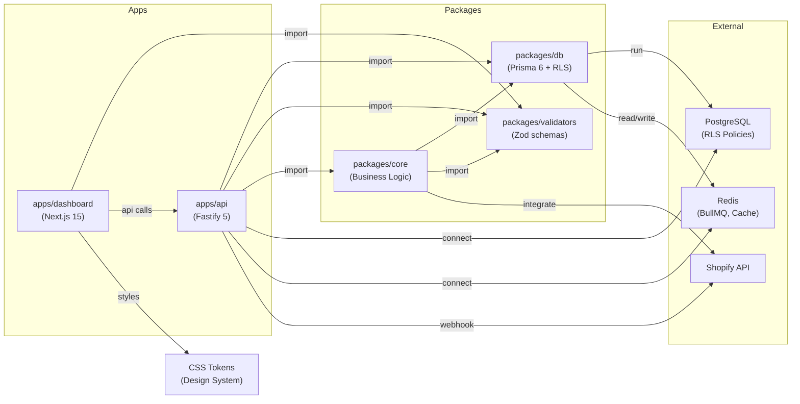
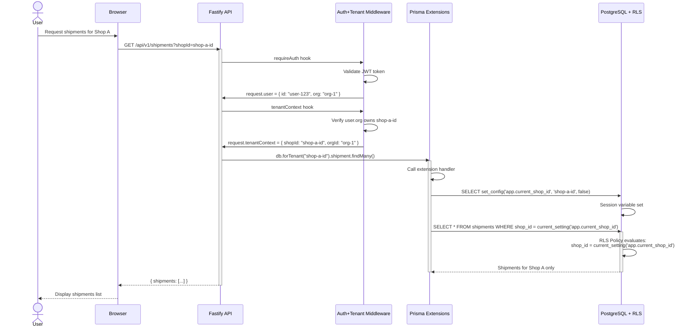

# ADR-001: Modular Turborepo Architecture with Prisma Schema Federation

**Date**: 2026-03-06
**Status**: ACCEPTED
**Context**: Witylogix Phase 1 Foundation Restructuring
**Author**: CTO (Arjun Rao)

---

## Context

Witylogix is a Shopify-integrated last-mile delivery logistics SaaS platform that originally operated as a monolithic application. As the platform grew to support multi-tenant operations, complex routing algorithms, notification systems, and third-party integrations, several architectural pain points emerged:

1. **Monolithic Database Schema**: A single `schema.prisma` file had grown to 1,216 lines, making it difficult to maintain, version, and understand relationships between domains.

2. **Tangled Dependencies**: Code from different business domains (routing, notifications, integrations, billing) was intermingled, creating circular dependencies and making unit testing difficult.

3. **Scalability Constraints**: Deploying new features or services required rebuilding and redeploying the entire monolith, even for isolated business logic changes.

4. **Multi-Tenancy Complexity**: Row-level security (RLS) implementation was ad-hoc, with tenant context passed through request objects rather than enforced at the database layer, creating security vulnerabilities.

5. **Code Reusability**: Shared utilities, validators, and schemas were duplicated across frontend and backend code, leading to inconsistencies and maintenance burden.

6. **Design System Inconsistency**: UI components lacked a unified design system, with styles defined inline and scattered across multiple files.

## Decision

We have restructured Witylogix into a **modular Turborepo monorepo** with **schema federation via Prisma** and **multi-tenant RLS enforcement**. This architecture consists of six interconnected yet independently manageable components:

### 1. Turborepo Monorepo Structure with pnpm Workspaces

```
witylogix-platform/
├── packages/
│   ├── db/              # Prisma client & RLS extensions
│   ├── validators/      # Shared Zod validation schemas
│   └── core/            # Business logic (routing, notifications, integrations, templates)
├── apps/
│   ├── api/             # Fastify 5 REST API server
│   └── dashboard/       # Next.js 15 App Router admin UI
└── docs/
    └── adr/             # Architecture Decision Records
```

**Rationale**: Turborepo with pnpm workspaces provides:

- Monorepo benefits: single version control, atomic commits, unified dependency management
- Fast incremental builds via Turborepo's task caching
- Workspace isolation: each package has its own `package.json`, tsconfig, and build configuration
- Efficient disk usage: pnpm's symlink-based node_modules, reducing duplication

### 2. Prisma Schema Modularization via Schema Folder Feature

The 1,216-line monolithic schema has been decomposed into **18 modular `.prisma` files** using Prisma's `prismaSchemaFolder` preview feature:

```
packages/db/prisma/
├── schema/
│   ├── 00-config.prisma          # Datasource, generator, global settings
│   ├── 01-organizations.prisma   # Org and subscription models
│   ├── 02-shops.prisma           # Shopify shop integrations
│   ├── 03-locations.prisma       # Warehouse/fulfillment locations
│   ├── 04-products.prisma        # Product catalog and SKU management
│   ├── 05-orders.prisma          # E-commerce orders and items
│   ├── 06-shipments.prisma       # Shipment routing and tracking
│   ├── 07-carriers.prisma        # Carrier integrations (FedEx, UPS, etc.)
│   ├── 08-vehicles.prisma        # Fleet management
│   ├── 09-routes.prisma          # Optimized delivery routes
│   ├── 10-stops.prisma           # Route stops with geolocation
│   ├── 11-drivers.prisma         # Driver profiles and credentials
│   ├── 12-notifications.prisma   # Notification preferences and history
│   ├── 13-templates.prisma       # Template versioning and content
│   ├── 14-webhooks.prisma        # Shopify and third-party webhooks
│   ├── 15-integrations.prisma    # Third-party API credentials
│   ├── 16-audit-logs.prisma      # Compliance and audit trails
│   ├── 17-settings.prisma        # Feature flags and configurations
│   └── 25-cache-models.prisma    # Redis cache metadata models
└── migrations/
```

**Schema File Ordering (00-25)**:

- Files are lexicographically ordered via numeric prefixes
- `00-config.prisma` contains datasource and generator blocks only
- Models reference across files; Prisma resolves dependencies automatically
- Gaps in numbering (e.g., 18-24) reserved for future domains

**Benefits**:

- **Domain-driven organization**: Each `.prisma` file represents a business domain
- **Easier onboarding**: New developers understand system by reading domain files
- **Reduced merge conflicts**: Multiple teams can work on different domains simultaneously
- **Improved maintainability**: Schema changes are localized to relevant files
- **Better documentation**: Each file serves as a mini-schema contract for its domain

### 3. Multi-Tenant Row-Level Security (RLS) via Prisma Extensions

Multi-tenancy is enforced at the database layer using PostgreSQL RLS policies combined with Prisma `$extends` session variable management:

#### Session Variable Flow

```typescript
// packages/db/src/extensions.ts

export const dbWithRLS = (prisma: PrismaClient) =>
  prisma.$extends({
    query: {
      $allModels: {
        async $allOperations({ model, operation, args, query }) {
          // Set session context before executing query
          if (args.shopId || args.tenantId) {
            await prisma.$executeRawUnsafe(
              `SELECT set_config('app.current_shop_id', $1, false)`,
              [args.shopId || args.tenantId],
            );
          }
          return query(args);
        },
      },
    },
  });
```

#### RLS Extension Methods

**`forTenant(shopId)`**: Single-tenant context
Sets `app.current_shop_id` for shop-scoped queries:

```typescript
const shipments = await db.forTenant(shopId).shipment.findMany();
// WHERE (organization_id = current_setting('app.current_org_id'))
// AND (shop_id = current_setting('app.current_shop_id'))
```

**`forOrg(orgId)`**: Organization-wide context
Sets `app.current_org_id` for queries spanning multiple shops:

```typescript
const allOrders = await db.forOrg(orgId).order.findMany();
// WHERE organization_id = current_setting('app.current_org_id')
```

**`forTenantInOrg(shopId, orgId)`**: Dual-scoped context
Validates shop ownership before setting both variables:

```typescript
const routes = await db.forTenantInOrg(shopId, orgId).route.findMany();
// WHERE organization_id = orgId AND shop_id = shopId
// PostgreSQL enforces via RLS policies
```

#### Database-Level Enforcement

RLS policies in PostgreSQL prevent even privileged queries from bypassing tenant isolation:

```sql
-- Example RLS policy on shipments table
CREATE POLICY shop_isolation_shipments ON public.shipments
  AS RESTRICTIVE
  FOR ALL
  TO authenticated
  USING (
    shop_id = current_setting('app.current_shop_id')::uuid
    OR current_setting('app.current_shop_id') = ''
  );
```

**Defense-in-Depth Benefits**:

- Middleware enforces tenant context at API layer (code level)
- PostgreSQL RLS enforces at database layer (data level)
- SQL injection or middleware bypass cannot expose other tenants' data
- Auditable: all queries logged with session variables

### 4. Fastify 5 Plugin Architecture with TypeScript

The API is built on Fastify 5 with a plugin-based routing system, enabling modular feature development and easy testing:

#### Plugin Structure

```typescript
// apps/api/src/routes/shipments.routes.ts

import { FastifyInstance } from "fastify";
import { ShipmentService } from "@witylogix/core";
import { createShipmentSchema } from "@witylogix/validators";

export default async function shipmentRoutes(fastify: FastifyInstance) {
  // Register service as plugin
  fastify.register(ShipmentService);

  // Protected endpoint with RLS
  fastify.post<{ Body: CreateShipmentRequest }>(
    "/shipments",
    {
      preHandler: [fastify.authenticate, fastify.tenantContext],
      schema: { body: createShipmentSchema },
    },
    async (request, reply) => {
      const shipment = await fastify.shipmentService.create({
        ...request.body,
        shopId: request.tenantContext.shopId, // From middleware
      });
      return reply.code(201).send(shipment);
    },
  );

  // Domain-specific routes: GET /shipments/:id, PATCH, DELETE, etc.
}

// Register in main application
fastify.register(shipmentRoutes, { prefix: "/api/v1" });
```

#### Middleware Stack

All routes pass through a two-stage middleware chain:

1. **Authentication Middleware** (`requireAuth`)
   - Validates JWT token from Authorization header
   - Attaches user to `request.user`
   - Returns 401 if invalid or expired

2. **Tenant Context Middleware** (`tenantContext`)
   - Resolves `shopId` from query parameter or JWT claims
   - Validates user has access to shop
   - Attaches `request.tenantContext` with `{ shopId, orgId }`
   - Returns 403 if user lacks access

#### Error Handling

Structured error hierarchy via `AppError`:

```typescript
export class AppError extends Error {
  constructor(
    public code: string,
    public statusCode: number,
    public details?: Record<string, unknown>,
  ) {
    super();
  }
}

class ValidationError extends AppError {
  constructor(details: Record<string, unknown>) {
    super("VALIDATION_ERROR", 400, details);
  }
}

class UnauthorizedError extends AppError {
  constructor(message: string) {
    super("UNAUTHORIZED", 401, { message });
  }
}

class NotFoundError extends AppError {
  constructor(resource: string) {
    super("NOT_FOUND", 404, { resource });
  }
}
```

All routes catch errors and return JSON error responses with consistent structure:

```json
{
  "error": {
    "code": "VALIDATION_ERROR",
    "message": "Invalid input",
    "details": {
      "email": "Invalid email format"
    }
  }
}
```

#### Async Job Processing

Long-running operations use BullMQ workers:

```typescript
// Enqueue notification job
await fastify.notificationQueue.add("send-sms", {
  shipmentId,
  phoneNumber: request.body.phoneNumber,
  template: "shipment_ready_for_pickup",
  variables: { estimatedPickupTime: "2:00 PM" },
});

// Worker process
notificationWorker.process("send-sms", async (job) => {
  const { shipmentId, phoneNumber, template, variables } = job.data;
  const message = await templateEngine.render(template, variables);
  await twilioClient.messages.create({
    body: message,
    to: phoneNumber,
  });
});
```

### 5. Notification Template Engine

A custom Mustache-like template engine provides flexible, version-tracked notification rendering:

#### Template Syntax

```handlebars
Dear
{{customer.name}}, Your order #{{order.id}}
is ready for pickup! Estimated time:
{{formatDate pickup_time "short"}}

{{#if same_day_delivery}}
  We can deliver today for
  {{formatCurrency same_day_fee}}.
{{/if}}

{{#each delivery_options}}
  -
  {{name}}:
  {{formatCurrency price}}
{{/each}}

{{{raw_html}}}
<!-- Raw HTML (no escaping) -->
```

#### Built-In Helpers

| Helper           | Example                        | Output        |
| ---------------- | ------------------------------ | ------------- |
| `formatCurrency` | `{{formatCurrency 29.99}}`     | `$29.99`      |
| `formatDate`     | `{{formatDate date "short"}}`  | `Mar 6, 2026` |
| `uppercase`      | `{{uppercase "hello"}}`        | `HELLO`       |
| `lowercase`      | `{{lowercase "WORLD"}}`        | `world`       |
| `truncate`       | `{{truncate "hello world" 5}}` | `hello`       |

#### Version Tracking

```typescript
interface NotificationTemplate {
  id: string;
  name: string; // e.g., "shipment_ready_for_pickup"
  type: "sms" | "email" | "push";
  content: string;
  version: number; // Auto-incremented on updates
  variables: string[]; // e.g., ["customer.name", "order.id"]
  createdAt: Date;
  updatedAt: Date;
  updatedBy: string; // User ID
}
```

**Benefits**:

- Marketing teams can update copy without code deployment
- Version history enables rollback if needed
- Compiled templates cached in Redis for performance
- Audit trail tracks all template changes

### 6. Dashboard Design System with CSS Custom Properties

The admin dashboard uses a **token-based design system** built on CSS custom properties (not Tailwind) for maximum flexibility and brand consistency:

#### Design Token Structure

```css
/* packages/dashboard/styles/tokens.css */

:root {
  /* Colors */
  --wl-color-primary: #f5a623; /* Amber accent */
  --wl-color-primary-light: #fdd8a8;
  --wl-color-primary-dark: #d68a1b;

  --wl-color-neutral-50: #fafafa;
  --wl-color-neutral-900: #0f0f0f;
  --wl-color-neutral-text: #1f1f1f; /* Dark theme default */

  --wl-color-success: #10b981;
  --wl-color-warning: #f59e0b;
  --wl-color-error: #ef4444;

  /* Typography */
  --wl-font-family: -apple-system, BlinkMacSystemFont, "Segoe UI", sans-serif;
  --wl-font-size-xs: 0.75rem;
  --wl-font-size-sm: 0.875rem;
  --wl-font-size-base: 1rem;
  --wl-font-size-lg: 1.125rem;
  --wl-font-size-xl: 1.25rem;

  --wl-font-weight-regular: 400;
  --wl-font-weight-medium: 500;
  --wl-font-weight-semibold: 600;
  --wl-font-weight-bold: 700;

  /* Spacing */
  --wl-spacing-xs: 0.25rem;
  --wl-spacing-sm: 0.5rem;
  --wl-spacing-md: 1rem;
  --wl-spacing-lg: 1.5rem;
  --wl-spacing-xl: 2rem;

  /* Border Radius */
  --wl-radius-sm: 0.375rem;
  --wl-radius-md: 0.5rem;
  --wl-radius-lg: 0.75rem;

  /* Shadows */
  --wl-shadow-sm: 0 1px 2px 0 rgba(0, 0, 0, 0.05);
  --wl-shadow-md: 0 4px 6px -1px rgba(0, 0, 0, 0.1);
  --wl-shadow-lg: 0 10px 15px -3px rgba(0, 0, 0, 0.1);
}

/* Dark theme (default) */
[data-theme="dark"] {
  --wl-bg-primary: #0f0f0f;
  --wl-bg-secondary: #1a1a1a;
  --wl-bg-tertiary: #242424;
  --wl-text-primary: #ffffff;
  --wl-text-secondary: #a0a0a0;
}

/* Light theme variant */
[data-theme="light"] {
  --wl-bg-primary: #ffffff;
  --wl-bg-secondary: #f9f9f9;
  --wl-bg-tertiary: #f0f0f0;
  --wl-text-primary: #0f0f0f;
  --wl-text-secondary: #666666;
}
```

#### Component Library

**Card** — Container for content grouping

```jsx
<Card className="wl-card">
  <Card.Header>
    <h2 style={{ color: "var(--wl-text-primary)" }}>Shipments</h2>
  </Card.Header>
  <Card.Body>{/* Content */}</Card.Body>
</Card>
```

**Badge** — Status indicators

```jsx
<Badge variant="success">Delivered</Badge>
<Badge variant="warning">In Transit</Badge>
<Badge variant="error">Failed</Badge>
```

**Button** — Call-to-action controls

```jsx
<Button variant="primary" size="md">
  Create Shipment
</Button>
<Button variant="secondary" disabled>
  Disabled
</Button>
```

**StatCard** — KPI display

```jsx
<StatCard
  label="Total Deliveries"
  value="1,234"
  trend={+12}
  icon={<TrendingUpIcon />}
/>
```

#### Styling Approach

All components use **inline style objects with token references**:

```jsx
export const Card = ({ children, className }) => (
  <div
    style={{
      backgroundColor: "var(--wl-bg-secondary)",
      border: "1px solid var(--wl-color-neutral-200)",
      borderRadius: "var(--wl-radius-md)",
      padding: "var(--wl-spacing-lg)",
      boxShadow: "var(--wl-shadow-sm)",
    }}
    className={className}
  >
    {children}
  </div>
);
```

**Why Not Tailwind?**

- Tailwind's utility classes require significant learning curve for large teams
- CSS custom properties allow non-technical users (designers, marketers) to adjust colors/spacing in CSS files without touching component code
- Complete control over design system evolution without Tailwind major version constraints
- Better performance: minimal CSS bundle, no purging logic needed

---

## Consequences

### Positive

1. **Scalability**: Teams can develop features independently in isolated packages; builds remain fast via Turborepo caching.

2. **Maintainability**: Domain-driven schema organization makes onboarding faster and reduces cognitive load when modifying data models.

3. **Security**: Multi-tenant RLS enforced at both API and database layers provides defense-in-depth protection against data leakage.

4. **Reusability**: Shared validators, core business logic, and UI components are centralized in packages, reducing duplication.

5. **Developer Experience**:
   - Fastify plugins are lightweight and fast to develop
   - TypeScript ensures type safety across API and dashboard
   - Structured error handling provides consistent debugging experience

6. **Operations**: Template versioning and feature flags enable non-engineer deployments of marketing copy and A/B experiments.

### Negative / Trade-offs

1. **Complexity**: Monorepo setup requires discipline; developers must understand workspace dependencies and pnpm symlink behavior.

2. **Build Performance**: Large number of packages may increase initial CI/CD setup time; requires careful Turborepo configuration to avoid redundant builds.

3. **Database Migrations**: Schema federation complicates migration workflows; migrations still run against single database, requiring careful ordering.

4. **Learning Curve**: Custom template engine and design system are non-standard; new team members require training.

5. **Debugging**: RLS policies are invisible to ORM; queries that should return data silently return empty arrays if session variables not set correctly.

### Mitigation Strategies

- **Monorepo Discipline**: Enforce dependency graph rules via ESLint plugin; document workspace boundaries
- **CI/CD Optimization**: Configure Turborepo task caching, parallel test execution, and affected package detection
- **Schema Ordering**: Document schema file ordering; auto-generate schema dependency graph in CI
- **RLS Testing**: Unit tests for RLS by mocking session variables; integration tests with real PostgreSQL RLS policies
- **Onboarding**: Create template generator (`create-witylogix-package`) to scaffold new packages with correct tsconfig, ESLint, and build configuration

---

## Alternatives Considered

### 1. Polyrepo (Separate Repositories per Service)

**Pros**: True service isolation; independent deployments; clear ownership boundaries

**Cons**:

- Difficult to keep API and validators in sync across repos
- Atomic commits across multiple repos impossible; ACID guarantees lost
- Dependency management nightmare (shared packages require git submodules or private npm registry)
- Code sharing requires publishing to npm, slowing development iteration

**Rejected**: For a SaaS product in growth phase, atomic commits and shared code velocity outweigh service isolation benefits.

### 2. Monolithic Fastify Application (Status Quo)

**Pros**: Simple deployment; no dependency management; easier onboarding initially

**Cons**:

- Schema file already 1,216 lines and still growing
- All features must deploy together; risky for critical bug fixes
- Difficult to parallelize development across teams
- RLS implementation ad-hoc and error-prone

**Rejected**: Scalability bottleneck; already experiencing merge conflicts and deployment delays.

### 3. GraphQL API (instead of REST + Fastify)

**Pros**:

- Single query language for frontend and mobile clients
- No over-fetching; clients specify exact fields needed
- Self-documenting via schema

**Cons**:

- Steeper learning curve; fewer team members experienced with GraphQL
- Complex authorization (field-level permissions) requires custom middleware
- Debugging slower (opaque query strings vs. clear REST endpoints)
- GraphQL subscriptions add infrastructure complexity

**Rejected**: REST + Fastify sufficient for current use cases; can migrate to GraphQL in Phase 2 if needed.

### 4. Tailwind CSS (instead of CSS Custom Properties)

**Pros**:

- Massive ecosystem; pre-built component libraries
- Better IDE autocomplete for class names
- Smaller team can maintain complex designs

**Cons**:

- Large CSS bundle (requires PurgeCSS configuration)
- Utility classes scattered in component files; difficult for designers to adjust without touching code
- Opinionated constraints limit design flexibility
- Non-technical team members cannot tweak spacing/colors

**Rejected**: Team has design system expertise; CSS custom properties provide better flexibility and accessibility to non-engineers.

### 5. Single Monolithic Prisma Schema (Status Quo)

**Pros**: Simple to understand initially; fewer files to track

**Cons**:

- 1,216 lines difficult to navigate
- Merge conflicts when multiple teams modify schema
- No clear domain boundaries
- Hard to test individual schema sections

**Rejected**: Prisma schema folder feature specifically designed to solve this; now adopted in Phase 1.

---

## Implementation Timeline

| Phase         | Deliverable                                                | Timeline              |
| ------------- | ---------------------------------------------------------- | --------------------- |
| **Phase 1** ✓ | Turborepo setup, schema modularization, RLS extensions     | Complete              |
| **Phase 1.5** | Dashboard design system, template engine v1                | In Progress (current) |
| **Phase 2**   | Service extraction (routing microservice), GraphQL gateway | Q2 2026               |
| **Phase 3**   | Mobile app (React Native), webhook v2                      | Q3 2026               |

---

## Dependency Diagram



---

## RLS Multi-Tenancy Sequence Diagram



---

## File Structure Reference

```
witylogix-platform/
├── apps/
│   ├── api/
│   │   ├── src/
│   │   │   ├── index.ts                 # Fastify entry point
│   │   │   ├── routes/                  # Domain route plugins
│   │   │   │   ├── shipments.routes.ts
│   │   │   │   ├── orders.routes.ts
│   │   │   │   └── drivers.routes.ts
│   │   │   ├── middleware/              # Auth, RLS context, error handling
│   │   │   │   ├── auth.ts
│   │   │   │   └── tenant-context.ts
│   │   │   ├── services/                # Business logic (or import from core)
│   │   │   └── workers/                 # BullMQ job handlers
│   │   ├── tests/
│   │   └── package.json
│   │
│   └── dashboard/
│       ├── app/
│       │   ├── layout.tsx               # Root layout with theme provider
│       │   ├── page.tsx                 # Home/dashboard
│       │   ├── shipments/               # Feature pages
│       │   ├── drivers/
│       │   └── settings/
│       ├── components/
│       │   ├── ui/                      # Design system components
│       │   │   ├── Card.tsx
│       │   │   ├── Button.tsx
│       │   │   ├── Badge.tsx
│       │   │   └── StatCard.tsx
│       │   └── features/                # Page-specific components
│       ├── styles/
│       │   ├── tokens.css               # CSS custom properties
│       │   └── globals.css
│       ├── lib/
│       │   └── api.ts                   # API client wrapper
│       └── package.json
│
├── packages/
│   ├── db/
│   │   ├── prisma/
│   │   │   ├── schema/
│   │   │   │   ├── 00-config.prisma
│   │   │   │   ├── 01-organizations.prisma
│   │   │   │   ├── 02-shops.prisma
│   │   │   │   ├── 03-locations.prisma
│   │   │   │   ├── 04-products.prisma
│   │   │   │   ├── 05-orders.prisma
│   │   │   │   ├── 06-shipments.prisma
│   │   │   │   ├── 07-carriers.prisma
│   │   │   │   ├── 08-vehicles.prisma
│   │   │   │   ├── 09-routes.prisma
│   │   │   │   ├── 10-stops.prisma
│   │   │   │   ├── 11-drivers.prisma
│   │   │   │   ├── 12-notifications.prisma
│   │   │   │   ├── 13-templates.prisma
│   │   │   │   ├── 14-webhooks.prisma
│   │   │   │   ├── 15-integrations.prisma
│   │   │   │   ├── 16-audit-logs.prisma
│   │   │   │   ├── 17-settings.prisma
│   │   │   │   └── 25-cache-models.prisma
│   │   │   └── migrations/
│   │   ├── src/
│   │   │   ├── client.ts                # PrismaClient singleton
│   │   │   ├── extensions.ts            # RLS extensions (forTenant, forOrg)
│   │   │   └── index.ts                 # Public exports
│   │   └── package.json
│   │
│   ├── validators/
│   │   ├── src/
│   │   │   ├── shipments.ts             # Zod schemas per domain
│   │   │   ├── orders.ts
│   │   │   ├── drivers.ts
│   │   │   └── index.ts
│   │   └── package.json
│   │
│   └── core/
│       ├── src/
│       │   ├── routing/                 # Delivery route optimization
│       │   ├── notifications/           # Template engine, queue management
│       │   ├── integrations/            # Shopify, carrier APIs
│       │   └── index.ts
│       └── package.json
│
├── docs/
│   └── adr/
│       ├── 001-modular-architecture.md  # This file
│       └── 002-*.md
│
├── pnpm-workspace.yaml
├── turbo.json                          # Turborepo configuration
└── package.json
```

---

## Related ADRs

- **ADR-002** (Pending): Fastify 5 API Design & Error Handling Patterns
- **ADR-003** (Pending): Notification System Architecture
- **ADR-004** (Pending): Delivery Route Optimization Algorithm

---

## Approval & Review

| Role                | Name             | Date       | Signature |
| ------------------- | ---------------- | ---------- | --------- |
| CTO                 | Arjun Rao        | 2026-03-06 | ✓         |
| Tech Lead           | [To be assigned] | -          | -         |
| Infrastructure Lead | [To be assigned] | -          | -         |

---

## Appendix: Prisma Schema File Breakdown

### 00-config.prisma

```prisma
datasource db {
  provider = "postgresql"
  url      = env("DATABASE_URL")
}

generator client {
  provider = "prisma-client-js"
}
```

### 01-organizations.prisma

```prisma
model Organization {
  id          String   @id @default(cuid())
  name        String
  tier        String   @default("starter")
  subscription Subscription?
  shops       Shop[]
  createdAt   DateTime @default(now())
  updatedAt   DateTime @updatedAt

  @@map("organizations")
}

model Subscription {
  id              String   @id @default(cuid())
  organizationId  String   @unique
  organization    Organization @relation(fields: [organizationId], references: [id], onDelete: Cascade)
  planId          String
  status          String   @default("active")
  renewalDate     DateTime
  createdAt       DateTime @default(now())

  @@map("subscriptions")
}
```

### 02-shops.prisma

```prisma
model Shop {
  id              String   @id @default(cuid())
  organizationId  String
  organization    Organization @relation(fields: [organizationId], references: [id], onDelete: Cascade)
  name            String
  shopifyDomain   String   @unique
  accessToken     String   @db.Text
  scope           String
  orders          Order[]
  shipments       Shipment[]
  createdAt       DateTime @default(now())
  updatedAt       DateTime @updatedAt

  @@index([organizationId])
  @@map("shops")
}
```

### 06-shipments.prisma

```prisma
model Shipment {
  id          String   @id @default(cuid())
  shopId      String
  shop        Shop     @relation(fields: [shopId], references: [id], onDelete: Cascade)
  orderId     String
  order       Order    @relation(fields: [orderId], references: [id], onDelete: Cascade)
  routeId     String?
  route       Route?   @relation(fields: [routeId], references: [id])
  status      String   @default("pending")
  carrier     String
  trackingNo  String?  @unique
  estimatedAt DateTime?
  deliveredAt DateTime?
  createdAt   DateTime @default(now())

  @@index([shopId])
  @@index([routeId])
  @@map("shipments")
}
```

### 13-templates.prisma

```prisma
model NotificationTemplate {
  id          String   @id @default(cuid())
  name        String   @unique
  type        String   // 'sms' | 'email' | 'push'
  content     String   @db.Text
  version     Int      @default(1)
  variables   String[] // ["customer.name", "order.id"]
  createdAt   DateTime @default(now())
  updatedAt   DateTime @updatedAt
  updatedBy   String   // User ID
  history     TemplateVersion[]

  @@map("notification_templates")
}

model TemplateVersion {
  id          String   @id @default(cuid())
  templateId  String
  template    NotificationTemplate @relation(fields: [templateId], references: [id], onDelete: Cascade)
  version     Int
  content     String   @db.Text
  createdAt   DateTime @default(now())
  createdBy   String

  @@unique([templateId, version])
  @@map("template_versions")
}
```

---

## References

- [Prisma Schema Folder Feature](https://www.prisma.io/docs/concepts/components/prisma-schema#multiple-files)
- [PostgreSQL Row-Level Security](https://www.postgresql.org/docs/current/ddl-rowsecurity.html)
- [Turborepo Documentation](https://turbo.build/repo/docs)
- [Fastify Plugin System](https://www.fastify.io/docs/latest/Guides/Plugins/)
- [pnpm Workspaces](https://pnpm.io/workspaces)
- [Zod Schema Validation](https://zod.dev/)

---

**Document Version**: 1.0
**Last Updated**: 2026-03-06
**Next Review**: 2026-06-06
