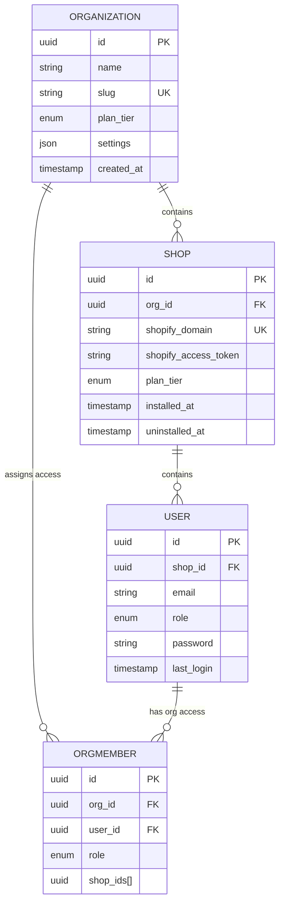
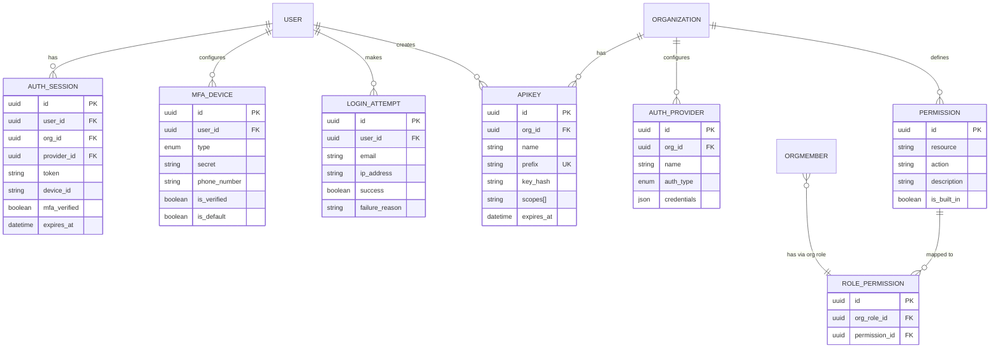
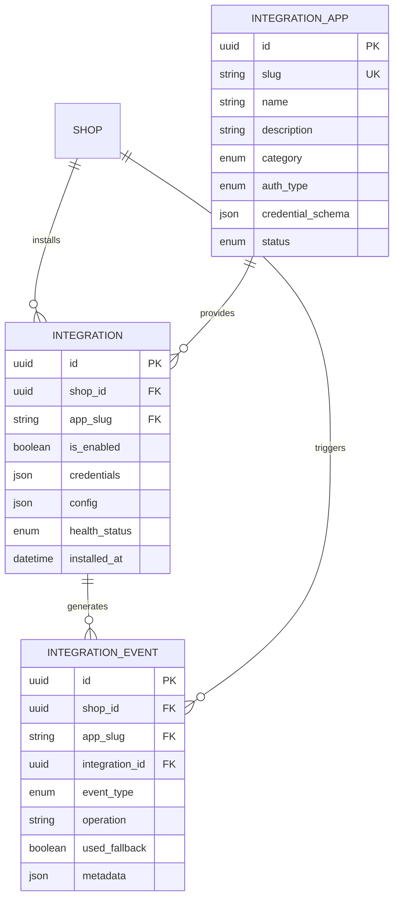

# Witylogix Database Entity Relationships

## 1. Core Tenant Hierarchy



---

## 2. Order → Delivery → Driver Flow

```mermaid
erDiagram
    SHOP ||--o{ ORDER : creates
    SHOP ||--o{ DELIVERY_ZONE : "defines zones"
    SHOP ||--o{ TIME_SLOT : "defines slots"
    SHOP ||--o{ ROUTE : "creates routes"
    SHOP ||--o{ DRIVER : "hires drivers"

    ORDER ||--o{ SHIPMENT : "splits into"
    ORDER ||--o{ PROOF_OF_DELIVERY : "has"

    SHIPMENT ||--o{ SHIPMENT_PROOF : "has"
    SHIPMENT }o--|| LOCATION : "ships from"
    SHIPMENT }o--|| DRIVER : "delivered by"
    SHIPMENT }o--|| TIME_SLOT : "in slot"
    SHIPMENT }o--|| ROUTE : "part of"

    ROUTE ||--o{ ROUTE_STOP : contains
    ROUTE_STOP }o--|| ORDER : "stops at"
    ROUTE_STOP }o--|| DRIVER : "driver"

    DELIVERY_ZONE ||--o{ TIME_SLOT : "constrains"

    DRIVER {
        uuid id PK
        uuid org_id FK
        uuid shop_id FK
        string name
        string phone
        enum vehicle_type
        enum status
    }

    ORDER {
        uuid id PK
        uuid shop_id FK
        string external_order_id
        enum status
        uuid driver_id FK
        datetime delivery_date
        uuid time_slot_id FK
    }

    SHIPMENT {
        uuid id PK
        uuid order_id FK
        uuid shop_id FK
        uuid driver_id FK
        string shipment_number UK
        enum status
        enum delivery_method
    }

    ROUTE {
        uuid id PK
        uuid shop_id FK
        uuid driver_id FK
        date date
        enum status
        json optimized_order
    }

    ROUTE_STOP {
        uuid id PK
        uuid route_id FK
        uuid order_id FK
        int sequence
        enum stop_type
        enum status
    }

    TIME_SLOT {
        uuid id PK
        uuid shop_id FK
        string start_time
        string end_time
        int max_capacity
    }

    DELIVERY_ZONE {
        uuid id PK
        uuid shop_id FK
        string name
        decimal base_rate
    }

    LOCATION {
        uuid id PK
        uuid shop_id FK
        string name
        string address_line1
    }

    PROOF_OF_DELIVERY {
        uuid id PK
        uuid order_id FK UK
        string photo_urls[]
        string recipient_name
    }

    SHIPMENT_PROOF {
        uuid id PK
        uuid shipment_id FK UK
        string photo_urls[]
        string recipient_name
    }
```

---

## 3. Authentication & Authorization



---

## 4. Billing & Subscriptions

```mermaid
erDiagram
    SHOP ||--|| BILLING_SUBSCRIPTION : "has"
    BILLING_SUBSCRIPTION }o--|| BILLING_PLAN : "subscribes to"
    BILLING_SUBSCRIPTION ||--o{ INVOICE : "receives"
    BILLING_SUBSCRIPTION ||--o{ STORE_QUOTA_USAGE : "tracks"

    BILLING_PLAN {
        string id PK
        string name UK
        string slug UK
        decimal price
        string interval
        json features
        json limits
        int trial_days
    }

    BILLING_SUBSCRIPTION {
        string id PK
        uuid shop_id FK UK
        string plan_id FK
        enum status
        datetime current_period_start
        datetime current_period_end
        datetime trial_end
        boolean cancel_at_period_end
    }

    INVOICE {
        string id PK
        string subscription_id FK
        uuid shop_id FK
        decimal amount
        string currency
        enum status
        json line_items
        decimal discount_amount
        datetime paid_at
    }

    STORE_QUOTA_USAGE {
        string id PK
        string subscription_id FK
        uuid shop_id FK
        string resource
        int current_usage
        date period_start
        date period_end
    }
```

---

## 5. Messaging & Notifications

```mermaid
erDiagram
    SHOP ||--o{ MESSAGE : "sends"
    SHOP ||--o{ MESSAGE_TEMPLATE : "has"
    SHOP ||--o{ WHATSAPP_CONFIG : "configures"

    MESSAGE_TEMPLATE ||--o{ MESSAGE : "used by"

    MESSAGE {
        uuid id PK
        uuid tenant_id FK
        uuid shop_id FK
        enum channel
        string recipient
        string subject
        string body
        uuid template_id FK
        enum status
        enum priority
        string external_id
    }

    MESSAGE_TEMPLATE {
        uuid id PK
        uuid tenant_id FK
        uuid shop_id FK
        enum channel
        string name UK
        string subject
        string body
        json variables
    }

    WHATSAPP_CONFIG {
        uuid id PK
        uuid tenant_id FK UK
        uuid shop_id FK
        string phone_number_id
        string business_account_id
        string access_token
        string webhook_secret
    }
```

---

## 6. Integration Marketplace



---

## 7. Onboarding & Tenant Configuration

```mermaid
erDiagram
    USER ||--|| ONBOARDING_PROGRESS : "has"
    ORGANIZATION ||--|| ONBOARDING_PROGRESS : "tracks"
    ORGANIZATION ||--|| WORKSPACE : "contains"
    WORKSPACE ||--|| WORKSPACE_SETTINGS : "has"
    WORKSPACE ||--o{ WORKSPACE_API_KEY : "has"
    WORKSPACE ||--o{ INTEGRATION_CONNECTION : "connects to"

    ORGANIZATION ||--|| TENANT_CONFIG : "has"
    ORGANIZATION ||--o{ INVITATION : "sends"
    ORGANIZATION ||--o{ APIKEY : "has"
    ORGANIZATION ||--o{ USAGE_RECORD : "tracks"
    ORGANIZATION ||--o{ USAGE_SUMMARY : "summarizes"
    ORGANIZATION ||--o{ WEBHOOK_SECRET : "signs"
    ORGANIZATION ||--o{ RATE_LIMIT_OVERRIDE : "configures"

    ONBOARDING_PROGRESS {
        uuid id PK
        uuid user_id FK UK
        uuid org_id FK
        string current_step
        string current_sub_step
        string completed_steps[]
        json data
        datetime started_at
        datetime completed_at
    }

    WORKSPACE {
        uuid id PK
        uuid org_id FK
        string name
        string slug
        enum deployment_type
        string industry
        string goals[]
        json settings
    }

    WORKSPACE_SETTINGS {
        uuid id PK
        uuid workspace_id FK UK
        string timezone
        string currency
        enum distance_unit
        enum weight_unit
    }

    WORKSPACE_API_KEY {
        uuid id PK
        uuid workspace_id FK
        string name
        string key_prefix UK
        string key_hash
        boolean is_active
    }

    INTEGRATION_CONNECTION {
        uuid id PK
        uuid workspace_id FK
        string integration_app_slug FK
        json credentials
        json config
        enum health_status
    }

    TENANT_CONFIG {
        uuid id PK
        uuid org_id FK UK
        string subdomain UK
        string custom_domain UK
        json features
        json limits
    }

    INVITATION {
        uuid id PK
        uuid org_id FK
        string email
        enum role
        string token UK
        datetime expires_at
        datetime accepted_at
    }

    APIKEY {
        uuid id PK
        uuid org_id FK
        string name
        string prefix UK
        string key_hash
        string scopes[]
        int rate_limit
        datetime expires_at
    }

    USAGE_RECORD {
        uuid id PK
        uuid org_id FK
        uuid api_key_id FK
        string endpoint
        string method
        int status_code
        int response_time_ms
    }

    USAGE_SUMMARY {
        uuid id PK
        uuid org_id FK
        date period
        int request_count
        bigint bandwidth_bytes
        int error_count
    }

    WEBHOOK_SECRET {
        uuid id PK
        uuid org_id FK
        string endpoint
        string secret
        enum algorithm
    }

    RATE_LIMIT_OVERRIDE {
        uuid id PK
        uuid org_id FK
        string endpoint
        int requests_per_minute
        int requests_per_hour
    }
```

---

## Key Relationship Patterns

### 1. Org-Level vs Shop-Level Scoping

- **Org-Level (shared):** `driver`, `location`, `delivery_zone`, `workspace`, `api_key`
- **Shop-Level (isolated):** `order`, `shipment`, `route`, `time_slot`, `user` (primary)
- **Both (flexible):** `driver`, `location`, `integration` (per-shop install)

### 2. Soft Deletion

Models use `is_active` (boolean) or `deleted_at` (timestamp) for soft deletes. Queries filter with `WHERE is_active = true`.

### 3. Immutable Records

- **Order**: Core fields immutable after creation; only status and metadata updated
- **Shipment**: Similar; core fields locked after assignment
- **ProofOfDelivery / ShipmentProof**: Immutable once created

### 4. Many-to-Many Examples

- **User ↔ Organization** via `OrgMember` (with role and shop filtering)
- **Permission ↔ Role** via `RolePermission` (fine-grained RBAC)
- **Integration ↔ Shop** via `Integration` (per-shop installation)

### 5. Cascade & Referential Actions

- **Organization** → deletions cascade to `Shop`, `User`, `Driver`, `Workspace`, etc.
- **Shop** → deletions cascade to `Order`, `Shipment`, `Route`, etc.
- **User** → deletions cascade to `AuthSession`, `MfaDevice`, `LoginAttempt`
- **Order** → cascades to `ProofOfDelivery`, `Shipment` (soft delete on order)

---

## Row-Level Security (RLS) Boundaries

### Shop-Level (Primary)

```sql
RLS Policy: app.current_shop_id = shop_id
Applies to: order, shipment, route, route_stop, time_slot, location, integration, etc.
```

### Organization-Level (Secondary)

```sql
RLS Policy: app.current_org_id = org_id
Applies to: driver, location, delivery_zone, workspace, tenant_config, api_key, usage_record, webhook_secret
```

### Hybrid (Org OR Shop)

```sql
RLS Policy: (app.current_org_id = org_id) OR (app.current_shop_id = shop_id)
Applies to: org_member (cross-org access), integration_connection (workspace scoped)
```

---

## Next Steps for Visualization

1. **Auto-generate diagrams:** Use `/packages/db/scripts/generate-er-diagram.ts` to refresh these
2. **Add custom views:** Create specialized ER diagrams for reporting and analytics
3. **PostGIS relationships:** Update geometry-related diagrams when PostGIS is enabled
4. **Monitor growth:** As new models are added, refresh and categorize diagrams
